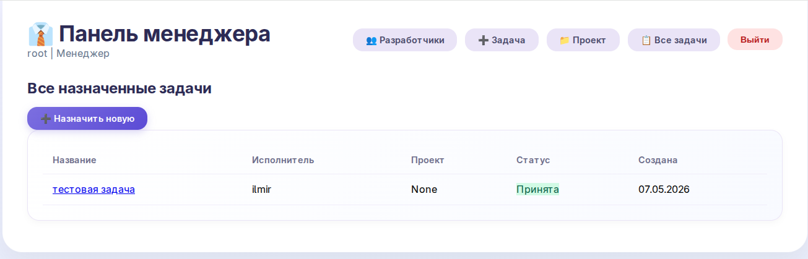
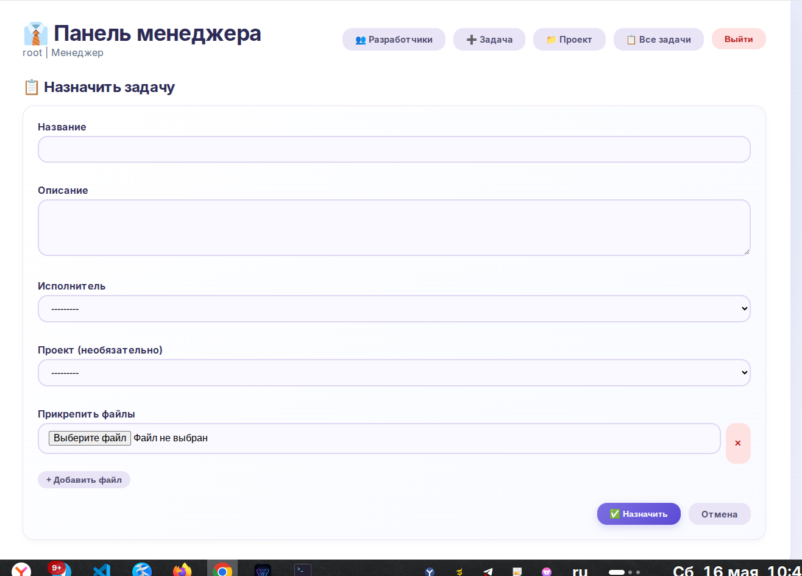
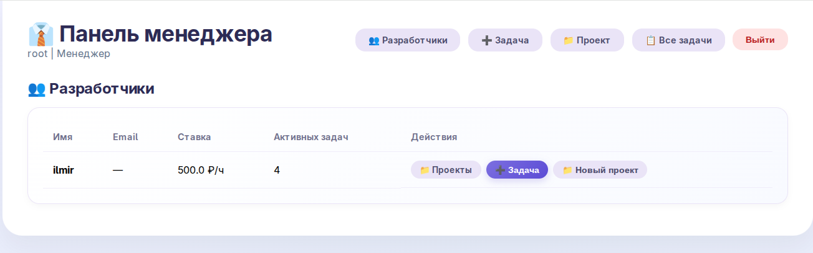
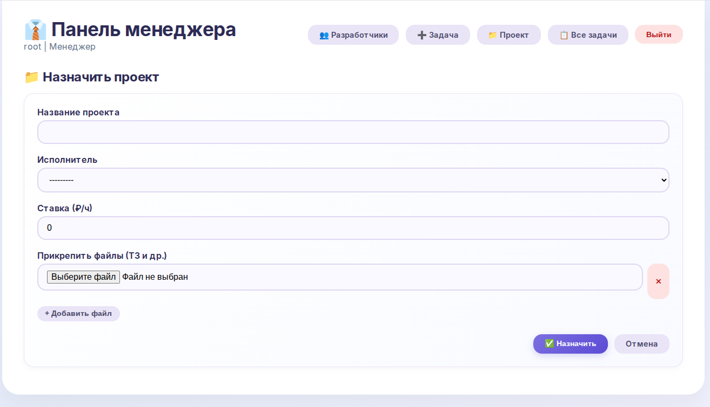
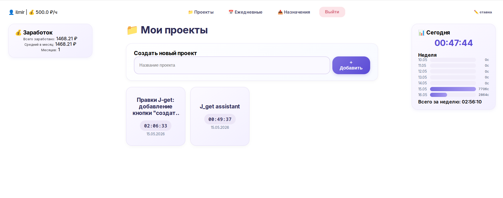
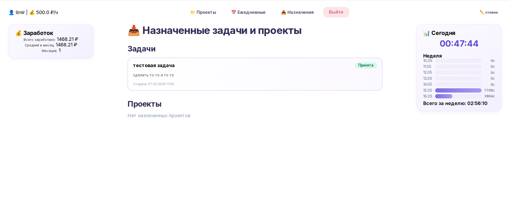
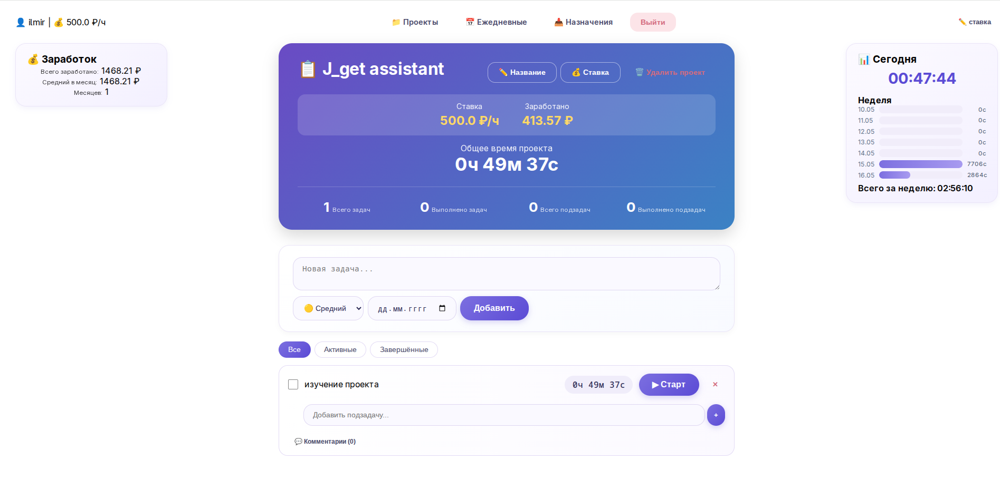

# Work Board – Система учета рабочего времени и управления задачами


**Work Board** – это веб-приложение на Django для учета рабочего времени, управления проектами и задачами с функцией трекинга времени и расчета заработка по почасовой ставке. Система разделена на два интерфейса: для разработчиков и для менеджеров.

## 📋 Основные возможности

### 👨‍💻 Для разработчиков
- **Управление проектами** – создание, редактирование, удаление проектов с указанием почасовой ставки
- **Трекинг времени** – встроенный таймер для задач и подзадач с автоматическим расчетом затраченного времени
- **Задачи и подзадачи** – иерархическая структура задач с возможностью добавления комментариев
- **Ежедневная статистика** – обзор отработанного времени и заработка за день
- **Мои назначения** – просмотр задач, назначенных менеджером
- **История рабочих сессий** – детальная информация по каждому периоду работы

### 👨‍💼 Для менеджеров
- **Управление разработчиками** – просмотр списка разработчиков и их проектов
- **Назначение задач** – создание и назначение задач разработчикам с приоритетами и сроками
- **Отслеживание прогресса** – мониторинг выполнения задач и затраченного времени
- **Уведомления** – система оповещений о новых назначениях и изменениях
- **Прикрепление файлов** – возможность добавлять вложения к назначенным задачам

### 📊 Общие функции
- **Аутентификация и авторизация** – регистрация, вход, разделение ролей
- **Расчет заработка** – автоматический расчет заработка на основе почасовой ставки и отработанного времени
- **Экспорт данных** – возможность экспорта статистики (в разработке)
- **Адаптивный интерфейс** – удобный веб-интерфейс с поддержкой мобильных устройств

## 🏗️ Архитектура и технологии

- **Бэкенд:** Django 6.0.3
- **Фронтенд:** HTML, CSS, JavaScript (нативный JS для таймера)
- **База данных:** SQLite (по умолчанию, можно заменить на PostgreSQL)
- **Сервер:** Gunicorn + Whitenoise для статики
- **Контейнеризация:** Docker + Docker Compose
- **Язык:** Python 3.12


## Скриншоты интерфейс менеджера (админа)









## Скриншоты интерфейс разработчика







## 📁 Структура проекта

```
work_board/
├── config/                 # Настройки Django
├── core/                   # Общее ядро (контекст-процессоры, утилиты)
├── developers/             # Приложение для разработчиков
│   ├── models.py          # Модели: Project, Task, SubTask, DailyWorkSession
│   ├── views.py           # Представления для разработчиков
│   ├── api.py             # API endpoints (в разработке)
│   └── templates/         # Шаблоны для разработчиков
├── managers/              # Приложение для менеджеров
│   ├── models.py          # Модели: AssignedTask, ProjectAssignment
│   ├── views.py           # Представления для менеджеров
│   └── templates/         # Шаблоны для менеджеров
├── users/                 # Приложение пользователей
│   ├── models.py          # Кастомная модель User
│   └── views.py           # Регистрация, аутентификация
├── templates/             # Базовые шаблоны
├── static/                # Статические файлы (JS, CSS)
├── media/                 # Загружаемые файлы (вложения)
├── requirements.txt       # Зависимости Python
├── Dockerfile            # Конфигурация Docker
├── compose.yml           # Docker Compose конфигурация
└── manage.py             # Точка входа Django
```


**Work Board** – эффективный инструмент для управления рабочим временем и повышения продуктивности команды разработки.